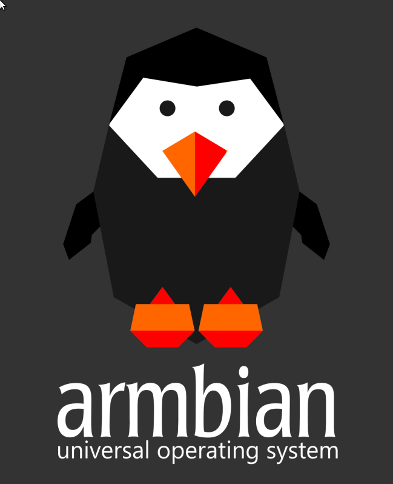

# Armbian vs  tvbox

## Armbian [Debian desktop Linux with XFCE] vs. allwinner/amlogic/rockchip tvbox with Android 
 
Tv box with Android, and "Discreet Launcher", with a normal launcher good for streaming, gaming, but the resolution not good for desktop computing. 
This low energy device with lan/bluetooth/wifi/audio/"4K" is like a cheap, silent, ideal tiny client pc with Armbian Linux + LibreOffice, Firefox ESR, Telegram, Kodi.. on XFCE lightweight desktop environment. 
 

## U can touch this - it's Hammer time! 

 
[Lookout, Armbian is pink, use Dark-Olympic theme after instalation!] 
[few storage? use clouds: megasync, filen, skiff..] 
 

 
**1. Etcher img burner [balena, AppImage] + mSD card + Armbian*.img** 

 
**2. rename: u-boot* to u-boot.ext** 
[mSD /BOOT/] 

 
**3. edit /BOOT/extlinux/extlinux.conf with texteditor** 
example: 
FDT /dtb/amlogic/frankojanko.dtb 
#FDT /dtb/amlogic/nem frankojanko.dtb 
 
**d. The DTB** 
[DeviceTree Compiler (DTC), device tree blob (DTB), device tree source (DTS), device tree overlay (DTO)] 
 

## dtb sources: 

 
**I. burned Armbian version's /BOOT/dtb/ folder** 
or 
 
**II. attached zip's - not the zip's, extract..** 
[Armbian_19, Armbian_2010, Armbian_2108, Armbian_2302, EmuELEC_42, EmuELEC_43] 
or 
 
**III. root/dev/dtb.img from Android with root file explorer [FX?]** 
[dd if=/dev/dtb | gzip > /*/*/dtb.img.gz] 
or 
 
**IV. dtc in CLI** 
dtc -I fs -o x.dtb /sys/firmware/devicetree/base 
dtc -I fs -O dtb /sys/firmware/devicetree/base -o x.dtb 
dtc -I dts -O dtb -o x.dtb x.dts 
dtc -I dts -O dtb -f x.dts -o x.dtb 
[pk install dtc, sudo apt-get install dtc] 
or 
 
**V. extract-dtb in CLI** 
extract-dtb /sys/firmware/devicetree/base -o /*/*/x 
[pk install extract-dtb, sudo apt-get install extract-dtb] 
 
**dtb/Amlogic name scheme:** 
 
gxbb > s905 
gxl > s905x 
g12a > s905x2 
g12b > s922x 
gxm > s912 
sm1 > s905x3 
 
**OS name scheme:** 
 
Armbian 23.02.1 (23-02-25).. 
Armbian 22.11.4 (23-01-23).. 
Armbian 22.02 (22-02-28).. 
Armbian 21.08 (21-08-31).. 
Armbian 21.02.1 (21-02-03).. 
Armbian 20.11 (20-11-24).. 
Armbian 20.08.22 (20-11-8).. 
 
Debian 14 forky 
Debian 13 trixie 
Debian 12 bookworm 
Debian 11 bullseye 
Debian 10 buster 
Debian 9 stretch 
 
Ubuntu 22.04 LTS Jammy Jellyfish 22-04-21 
Ubuntu 20.04 LTS Focal Fossa 20-04-23 
Ubuntu 18.04 LTS Bionic Beaver 18-04-26 
Ubuntu 16.04 LTS Xenial Xerus 16-04-21 
 

## Zip's content: 

[search: Ctrl+F, Ctrl+G] 
 

**Armbian_19**

meson-axg-s400.dtb
meson-g12a-u200.dtb
meson-gxbb-nanopi-k2.dtb
meson-gxbb-nexbox-a95x.dtb
meson-gxbb-odroidc2.dtb
meson-gxbb-p200.dtb
meson-gxbb-p201.dtb
meson-gxbb-vega-s95-meta.dtb
meson-gxbb-vega-s95-pro.dtb
meson-gxbb-vega-s95-telos.dtb
meson-gxbb-wetek-hub.dtb
meson-gxbb-wetek-play2.dtb
meson-gxl-s805x-libretech-ac.dtb
meson-gxl-s805x-p241.dtb
meson-gxl-s905d-p230.dtb
meson-gxl-s905d-p231.dtb
meson-gxl-s905d-phicomm-n1.dtb
meson-gxl-s905w-p281.dtb
meson-gxl-s905w-tx3-mini.dtb
meson-gxl-s905x-hwacom-amazetv.dtb
meson-gxl-s905x-khadas-vim.dtb
meson-gxl-s905x-libretech-cc.dtb
meson-gxl-s905x-nexbox-a95x.dtb
meson-gxl-s905x-p212.dtb
meson-gxm-khadas-vim2.dtb
meson-gxm-nexbox-a1.dtb
meson-gxm-q200.dtb
meson-gxm-q201.dtb
meson-gxm-rbox-pro.dtb
meson-gxm-vega-s96.dtb

**Armbian_2010**

allwinner/sun50i-a64-amarula-relic.dtb
allwinner/sun50i-a64-bananapi-m64.dtb
allwinner/sun50i-a64-nanopi-a64.dtb
allwinner/sun50i-a64-oceanic-5205-5inmfd.dtb
allwinner/sun50i-a64-olinuxino.dtb
allwinner/sun50i-a64-olinuxino-emmc.dtb
allwinner/sun50i-a64-orangepi-win.dtb
allwinner/sun50i-a64-pine64.dtb
allwinner/sun50i-a64-pine64-lts.dtb
allwinner/sun50i-a64-pine64-plus.dtb
allwinner/sun50i-a64-pinebook.dtb
allwinner/sun50i-a64-pinephone-1.0.dtb
allwinner/sun50i-a64-pinephone-1.1.dtb
allwinner/sun50i-a64-pinephone-1.2.dtb
allwinner/sun50i-a64-pinetab.dtb
allwinner/sun50i-a64-sopine-baseboard.dtb
allwinner/sun50i-a64-teres-i.dtb
allwinner/sun50i-h5-bananapi-m2-plus.dtb
allwinner/sun50i-h5-bananapi-m2-plus-v1.2.dtb
allwinner/sun50i-h5-emlid-neutis-n5-devboard.dtb
allwinner/sun50i-h5-libretech-all-h3-cc.dtb
allwinner/sun50i-h5-libretech-all-h3-it.dtb
allwinner/sun50i-h5-libretech-all-h5-cc.dtb
allwinner/sun50i-h5-nanopi-neo2.dtb
allwinner/sun50i-h5-nanopi-neo-plus2.dtb
allwinner/sun50i-h5-orangepi-pc2.dtb
allwinner/sun50i-h5-orangepi-prime.dtb
allwinner/sun50i-h5-orangepi-zero-plus.dtb
allwinner/sun50i-h5-orangepi-zero-plus2.dtb
allwinner/sun50i-h6-beelink-gs1.dtb
allwinner/sun50i-h6-orangepi-3.dtb
allwinner/sun50i-h6-orangepi-lite2.dtb
allwinner/sun50i-h6-orangepi-one-plus.dtb
allwinner/sun50i-h6-pine-h64.dtb
allwinner/sun50i-h6-pine-h64-model-b.dtb
allwinner/sun50i-h6-tanix-tx6.dtb

amlogic/meson-a1-ad401.dtb
amlogic/meson-axg-s400.dtb
amlogic/meson-g12a-gt1-mini-a.dtb
amlogic/meson-g12a-rockpi-w2.dtb
amlogic/meson-g12a-sei510.dtb
amlogic/meson-g12a-tanix-tx5max.dtb
amlogic/meson-g12a-u200.dtb
amlogic/meson-g12a-x96-max.dtb
amlogic/meson-g12a-x96-max-rmii.dtb
amlogic/meson-g12b-a311d-khadas-vim3.dtb
amlogic/meson-g12b-odroid-n2.dtb
amlogic/meson-g12b-s922x-khadas-vim3.dtb
amlogic/meson-g12b-ugoos-am6.dtb
amlogic/meson-gxbb-kii-pro.dtb
amlogic/meson-gxbb-nanopi-k2.dtb
amlogic/meson-gxbb-nexbox-a95x.dtb
amlogic/meson-gxbb-odroidc2.dtb
amlogic/meson-gxbb-p200.dtb
amlogic/meson-gxbb-p201.dtb
amlogic/meson-gxbb-vega-s95-meta.dtb
amlogic/meson-gxbb-vega-s95-pro.dtb
amlogic/meson-gxbb-vega-s95-telos.dtb
amlogic/meson-gxbb-wetek-hub.dtb
amlogic/meson-gxbb-wetek-play2.dtb
amlogic/meson-gxl-s805x-libretech-ac.dtb
amlogic/meson-gxl-s805x-p241.dtb
amlogic/meson-gxl-s905d-libretech-pc.dtb
amlogic/meson-gxl-s905d-p230.dtb
amlogic/meson-gxl-s905d-p231.dtb
amlogic/meson-gxl-s905d-phicomm-n1.dtb
amlogic/meson-gxl-s905d-sml5442tw.dtb
amlogic/meson-gxl-s905w-p281.dtb
amlogic/meson-gxl-s905w-tx3-mini.dtb
amlogic/meson-gxl-s905x-hwacom-amazetv.dtb
amlogic/meson-gxl-s905x-khadas-vim.dtb
amlogic/meson-gxl-s905x-libretech-cc.dtb
amlogic/meson-gxl-s905x-libretech-cc-v2.dtb
amlogic/meson-gxl-s905x-nexbox-a95x.dtb
amlogic/meson-gxl-s905x-p212.dtb
amlogic/meson-gxm-beelink-gt1.dtb
amlogic/meson-gxm-khadas-vim2.dtb
amlogic/meson-gxm-nexbox-a1.dtb
amlogic/meson-gxm-q200.dtb
amlogic/meson-gxm-q200-n1.dtb
amlogic/meson-gxm-q201.dtb
amlogic/meson-gxm-rbox-pro.dtb
amlogic/meson-gxm-s912-libretech-pc.dtb
amlogic/meson-gxm-vega-s96.dtb
amlogic/meson-gxm-wetek-core2.dtb
amlogic/meson-sm1-sei610.dtb

rockchip/px30-evb.dtb
rockchip/rk3308-evb.dtb
rockchip/rk3308-roc-cc.dtb
rockchip/rk3326-odroid-go2.dtb
rockchip/rk3328-a1.dtb
rockchip/rk3328-box.dtb
rockchip/rk3328-box-trn9.dtb
rockchip/rk3328-box-z28.dtb
rockchip/rk3328-evb.dtb
rockchip/rk3328-roc-cc.dtb
rockchip/rk3328-rock64.dtb
rockchip/rk3328-roc-pc.dtb
rockchip/rk3368-evb-act8846.dtb
rockchip/rk3368-geekbox.dtb
rockchip/rk3368-lion-haikou.dtb
rockchip/rk3368-orion-r68-meta.dtb
rockchip/rk3368-px5-evb.dtb
rockchip/rk3368-r88.dtb
rockchip/rk3399-evb.dtb
rockchip/rk3399-ficus.dtb
rockchip/rk3399-firefly.dtb
rockchip/rk3399-gru-bob.dtb
rockchip/rk3399-gru-kevin.dtb
rockchip/rk3399-gru-scarlet-inx.dtb
rockchip/rk3399-gru-scarlet-kd.dtb
rockchip/rk3399-hugsun-x99.dtb
rockchip/rk3399-khadas-edge.dtb
rockchip/rk3399-khadas-edge-captain.dtb
rockchip/rk3399-khadas-edge-v.dtb
rockchip/rk3399-leez-p710.dtb
rockchip/rk3399-nanopc-t4.dtb
rockchip/rk3399-nanopi-m4.dtb
rockchip/rk3399-nanopi-neo4.dtb
rockchip/rk3399-orangepi.dtb
rockchip/rk3399-pinebook-pro.dtb
rockchip/rk3399pro-rock-pi-n10.dtb
rockchip/rk3399-puma-haikou.dtb
rockchip/rk3399-rock960.dtb
rockchip/rk3399-rock-pi-4.dtb
rockchip/rk3399-rockpro64.dtb
rockchip/rk3399-rockpro64-v2.dtb
rockchip/rk3399-roc-pc.dtb
rockchip/rk3399-roc-pc-mezzanine.dtb
rockchip/rk3399-sapphire.dtb
rockchip/rk3399-sapphire-excavator.dtb

**Armbian_2108**

amlogic/meson-a1-ad401.dtb
amlogic/meson-axg-s400.dtb
amlogic/meson-g12a-gt1-mini-a.dtb
amlogic/meson-g12a-sei510.dtb
amlogic/meson-g12a-u200.dtb
amlogic/meson-g12a-x96-max.dtb
amlogic/meson-g12b-a311d-khadas-vim3.dtb
amlogic/meson-g12b-gtking.dtb
amlogic/meson-g12b-gtking-pro.dtb
amlogic/meson-g12b-odroid-n2.dtb
amlogic/meson-g12b-odroid-n2-plus.dtb
amlogic/meson-g12b-s922x-khadas-vim3.dtb
amlogic/meson-g12b-ugoos-am6.dtb
amlogic/meson-gxbb-kii-pro.dtb
amlogic/meson-gxbb-nanopi-k2.dtb
amlogic/meson-gxbb-nexbox-a95x.dtb
amlogic/meson-gxbb-odroidc2.dtb
amlogic/meson-gxbb-p200.dtb
amlogic/meson-gxbb-p201.dtb
amlogic/meson-gxbb-vega-s95-meta.dtb
amlogic/meson-gxbb-vega-s95-pro.dtb
amlogic/meson-gxbb-vega-s95-telos.dtb
amlogic/meson-gxbb-wetek-hub.dtb
amlogic/meson-gxbb-wetek-play2.dtb
amlogic/meson-gxl-s805x-libretech-ac.dtb
amlogic/meson-gxl-s805x-p241.dtb
amlogic/meson-gxl-s905d-libretech-pc.dtb
amlogic/meson-gxl-s905d-p230.dtb
amlogic/meson-gxl-s905d-p231.dtb
amlogic/meson-gxl-s905d-phicomm-n1.dtb
amlogic/meson-gxl-s905d-sml5442tw.dtb
amlogic/meson-gxl-s905w-p281.dtb
amlogic/meson-gxl-s905w-tx3-mini.dtb
amlogic/meson-gxl-s905x-hwacom-amazetv.dtb
amlogic/meson-gxl-s905x-khadas-vim.dtb
amlogic/meson-gxl-s905x-libretech-cc.dtb
amlogic/meson-gxl-s905x-libretech-cc-v2.dtb
amlogic/meson-gxl-s905x-nexbox-a95x.dtb
amlogic/meson-gxl-s905x-p212.dtb
amlogic/meson-gxm-khadas-vim2.dtb
amlogic/meson-gxm-nexbox-a1.dtb
amlogic/meson-gxm-q200.dtb
amlogic/meson-gxm-q201.dtb
amlogic/meson-gxm-rbox-pro.dtb
amlogic/meson-gxm-s912-libretech-pc.dtb
amlogic/meson-gxm-vega-s96.dtb
amlogic/meson-gxm-wetek-core2.dtb
amlogic/meson-sm1-khadas-vim3l.dtb
amlogic/meson-sm1-odroid-c4.dtb
amlogic/meson-sm1-odroid-hc4.dtb
amlogic/meson-sm1-sei610.dtb

rockchip/px30-evb.dtb
rockchip/rk3308-evb.dtb
rockchip/rk3308-roc-cc.dtb
rockchip/rk3318-a95x-z2.dtb
rockchip/rk3326-odroid-go2.dtb
rockchip/rk3328-a1.dtb
rockchip/rk3328-evb.dtb
rockchip/rk3328-nanopi-r2s.dtb
rockchip/rk3328-roc-cc.dtb
rockchip/rk3328-rock64.dtb
rockchip/rk3368-evb-act8846.dtb
rockchip/rk3368-geekbox.dtb
rockchip/rk3368-lion-haikou.dtb
rockchip/rk3368-orion-r68-meta.dtb
rockchip/rk3368-px5-evb.dtb
rockchip/rk3368-r88.dtb
rockchip/rk3399-evb.dtb
rockchip/rk3399-ficus.dtb
rockchip/rk3399-firefly.dtb
rockchip/rk3399-gru-bob.dtb
rockchip/rk3399-gru-kevin.dtb
rockchip/rk3399-gru-scarlet-inx.dtb
rockchip/rk3399-gru-scarlet-kd.dtb
rockchip/rk3399-hugsun-x99.dtb
rockchip/rk3399-khadas-edge.dtb
rockchip/rk3399-khadas-edge-captain.dtb
rockchip/rk3399-khadas-edge-v.dtb
rockchip/rk3399-leez-p710.dtb
rockchip/rk3399-nanopc-t4.dtb
rockchip/rk3399-nanopi-m4.dtb
rockchip/rk3399-nanopi-neo4.dtb
rockchip/rk3399-orangepi.dtb
rockchip/rk3399-pinebook-pro.dtb
rockchip/rk3399pro-rock-pi-n10.dtb
rockchip/rk3399-puma-haikou.dtb
rockchip/rk3399-rock960.dtb
rockchip/rk3399-rock-pi-4a.dtb
rockchip/rk3399-rock-pi-4b.dtb
rockchip/rk3399-rock-pi-4c.dtb
rockchip/rk3399-rockpro64.dtb
rockchip/rk3399-rockpro64-v2.dtb
rockchip/rk3399-roc-pc.dtb
rockchip/rk3399-roc-pc-mezzanine.dtb
rockchip/rk3399-sapphire.dtb
rockchip/rk3399-sapphire-excavator.dtb

**Armbian_2302**

meson-a1-ad401.dtb
meson-axg-jethome-jethub-j100.dtb
meson-axg-jethome-jethub-j110-rev-2.dtb
meson-axg-jethome-jethub-j110-rev-3.dtb
meson-axg-s400.dtb
meson-g12a-gt1-mini-a.dtb
meson-g12a-radxa-zero.dtb
meson-g12a-sei510.dtb
meson-g12a-u200.dtb
meson-g12a-x96-max.dtb
meson-g12b-a311d-bananapi-m2s.dtb
meson-g12b-a311d-khadas-vim3.dtb
meson-g12b-gsking-x.dtb
meson-g12b-gtking.dtb
meson-g12b-gtking-pro.dtb
meson-g12b-odroid-n2.dtb
meson-g12b-odroid-n2-plus.dtb
meson-g12b-odroid-n2-plus-spi.dtb
meson-g12b-odroid-n2-spi.dtb
meson-g12b-radxa-zero2.dtb
meson-g12b-s922x-khadas-vim3.dtb
meson-g12b-ugoos-am6.dtb
meson-gxbb-kii-pro.dtb
meson-gxbb-nanopi-k2.dtb
meson-gxbb-nexbox-a95x.dtb
meson-gxbb-odroidc2.dtb
meson-gxbb-p200.dtb
meson-gxbb-p201.dtb
meson-gxbb-vega-s95-meta.dtb
meson-gxbb-vega-s95-pro.dtb
meson-gxbb-vega-s95-telos.dtb
meson-gxbb-wetek-hub.dtb
meson-gxbb-wetek-play2.dtb
meson-gxl-s805x-libretech-ac.dtb
meson-gxl-s805x-p241.dtb
meson-gxl-s905d-libretech-pc.dtb
meson-gxl-s905d-mecool-kii-pro.dtb
meson-gxl-s905d-p230.dtb
meson-gxl-s905d-p231.dtb
meson-gxl-s905d-phicomm-n1.dtb
meson-gxl-s905d-sml5442tw.dtb
meson-gxl-s905d-vero4k-plus.dtb
meson-gxl-s905w-jethome-jethub-j80.dtb
meson-gxl-s905w-p281.dtb
meson-gxl-s905w-tx3-mini.dtb
meson-gxl-s905x-hwacom-amazetv.dtb
meson-gxl-s905x-khadas-vim.dtb
meson-gxl-s905x-libretech-cc.dtb
meson-gxl-s905x-libretech-cc-v2.dtb
meson-gxl-s905x-nexbox-a95x.dtb
meson-gxl-s905x-p212.dtb
meson-gxm-gt1-ultimate.dtb
meson-gxm-khadas-vim2.dtb
meson-gxm-mecool-kiii-pro.dtb
meson-gxm-minix-neo-u9h.dtb
meson-gxm-nexbox-a1.dtb
meson-gxm-q200.dtb
meson-gxm-q201.dtb
meson-gxm-rbox-pro.dtb
meson-gxm-s912-libretech-pc.dtb
meson-gxm-vega-s96.dtb
meson-gxm-wetek-core2.dtb
meson-s4-s805x2-aq222.dtb
meson-sm1-a95xf3-air.dtb
meson-sm1-a95xf3-air-gbit.dtb
meson-sm1-bananapi-m2-pro.dtb
meson-sm1-bananapi-m5.dtb
meson-sm1-h96-max.dtb
meson-sm1-khadas-vim3l.dtb
meson-sm1-odroid-c4.dtb
meson-sm1-odroid-hc4.dtb
meson-sm1-sei610.dtb
meson-sm1-x96-air.dtb
meson-sm1-x96-air-gbit.dtb

**EmuELEC_42**

g12a_s905x2_2g.dtb
g12a_s905x2_2g_1gbit.dtb
g12a_s905x2_4g.dtb
g12a_s905x2_4g_1gbit.dtb
g12a_s905x2_beelink_gt1_mini_2g.dtb
g12a_s905x2_beelink_gt1_mini_4g.dtb
g12a_s905x2_beelink_gt_mini_a_2g.dtb
g12a_s905x2_beelink_gt_mini_a_4g.dtb
g12a_s905y2_2g.dtb
g12a_s905y2_4g.dtb
g12b_a311d_khadas_vim3.dtb
g12b_s922x_beelink_gs_king_x.dtb
g12b_s922x_beelink_gs_king_x_rev_a.dtb
g12b_s922x_beelink_gt_king.dtb
g12b_s922x_beelink_gt_king_rev_a.dtb
g12b_s922x_minix_u22xj.dtb
g12b_s922x_odroid_n2.dtb
g12b_s922x_odroid_n2_joystick.dtb
g12b_s922x_odroid_n2plus.dtb
g12b_s922x_odroid_n2plus_joystick.dtb
g12b_s922x_ugoos_am6_2g.dtb
g12b_s922x_ugoos_am6_4g.dtb
g12b_s922x_ugoos_am6_rev_a_2g.dtb
g12b_s922x_ugoos_am6_rev_a_4g.dtb
g12b_s922x_x88_king_rev_a.dtb
sm1_s905d3_khadas_vim3l.dtb
sm1_s905x3_2g.dtb
sm1_s905x3_2g_1gbit.dtb
sm1_s905x3_4g.dtb
sm1_s905x3_4g_1gbit.dtb
sm1_s905x3_bananapi_m2pro.dtb
sm1_s905x3_bananapi_m5.dtb
sm1_s905x3_beelink_gt1mini2_2g.dtb
sm1_s905x3_beelink_gt1mini2_4g.dtb
sm1_s905x3_odroid_c4.dtb
sm1_s905x3_odroid_c4_joystick.dtb
sm1_s905x3_odroid_hc4.dtb

**EmuELEC_43**

gxbb_p200.dtb
gxbb_p200_1G_1Gbit.dtb
gxbb_p200_1G_1Gbit_ks2.dtb
gxbb_p200_1G_1Gbit_RealtekWiFi.dtb
gxbb_p200_1G_100M.dtb
gxbb_p200_1G_100M_RealtekWiFi.dtb
gxbb_p200_1G_konig_4k.dtb
gxbb_p200_1G_wetek_hub.dtb
gxbb_p200_2G.dtb
gxbb_p200_2G_1Gbit.dtb
gxbb_p200_2G_1Gbit_OTG_Port.dtb
gxbb_p200_2G_1Gbit_RealtekWiFi.dtb
gxbb_p200_2G_100M.dtb
gxbb_p200_2G_100M_RealtekWiFi.dtb
gxbb_p200_2G_m8s+_k3_pro.dtb
gxbb_p200_2G_minix_neo_u1.dtb
gxbb_p200_2g_odroid_c2.dtb
gxbb_p200_2G_wetek_play_2.dtb
gxbb_p200_k1_plus.dtb
gxbb_p200_k1_plus_ser.dtb
gxbb_p200_k2_pro.dtb
gxbb_p200_k2_pro_ser.dtb
gxbb_p201.dtb
gxbb_p201_2G.dtb
gxl_p212_1g.dtb
gxl_p212_1g_g9sx.dtb
gxl_p212_1g_lepotato.dtb
gxl_p212_1g_nand.dtb
gxl_p212_1g_slowemmc.dtb
gxl_p212_2g.dtb
gxl_p212_2g_g9sx.dtb
gxl_p212_2g_kvim.dtb
gxl_p212_2g_lepotato.dtb
gxl_p212_2g_nand.dtb
gxl_p212_2g_slowemmc.dtb
gxl_p212_3g.dtb
gxl_p230_2g.dtb
gxl_p230_k1_pro.dtb
gxl_p230_k1_pro_ser.dtb
gxl_p231_1g_dm14.dtb
gxl_p231_1g_dvb.dtb
gxl_p231_1g_dvb_ser.dtb
gxl_p231_1g_m8s_dvb.dtb
gxl_p231_1g_m8s_dvb-s2.dtb
gxl_p231_2g_dvb.dtb
gxl_p231_2g_dvb_ser.dtb
gxl_p231_c300.dtb
gxl_p281_1g.dtb
gxl_p281_1g_a95xr2.dtb
gxl_p281_2g.dtb
gxl_p281_2g_a95xr2.dtb
gxm_kvim2.dtb
gxm_kvim2_2vtv.dtb
gxm_q200_1.5g.dtb
gxm_q200_1g.dtb
gxm_q200_2g.dtb
gxm_q200_2g_minix_neo_u9.dtb
gxm_q200_3g.dtb
gxm_q200_k3_pro.dtb
gxm_q200_k3_pro_ser.dtb
gxm_q201_1g.dtb
gxm_q201_2g.dtb
gxm_q201_2g_1gbit.dtb
gxm_q201_3g.dtb
gxm_q201_3g_1gbit.dtb
gxm_q201_3g_c400_plus.dtb
gxm_q201_c300_pro.dtb
